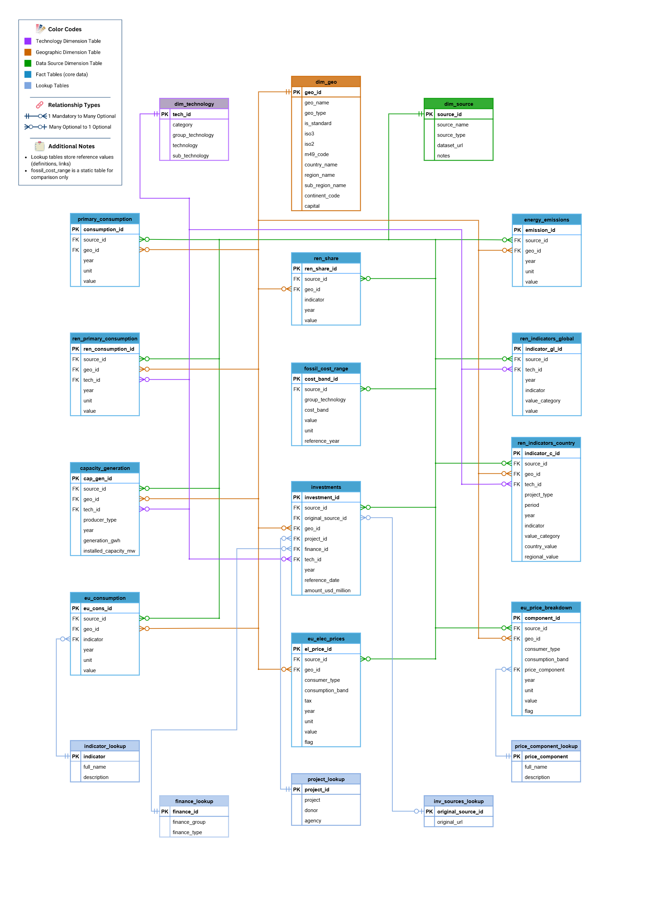

# Renewable Energy Analytics: End-to-End Data Pipeline & Global Transition Analysis

**Author:** Elene Kikalishvili &nbsp;|&nbsp; **Database:** PostgreSQL &nbsp;|&nbsp; **Prep:** Power Query &nbsp;|&nbsp; **Analysis:** SQL &nbsp;|&nbsp; **Visualization:** Tableau


**Last updated:** May 2026


## Table of Contents

- [Executive Summary](#executive-summary)
- [Research Questions](#research-questions)
- [Key Findings](#key-findings)
- [Data Coverage](#data-coverage)
- [Project Pipeline](#project-pipeline)
- [Database Design](#database-design)
- [SQL Analysis](#sql-analysis)
- [Tableau Dashboards](#tableau-dashboards)
- [Scope & Analytical Decisions](#scope--analytical-decisions)
- [Data Caveats & Limitations](#data-caveats--limitations)
- [Lessons Learned & Challenges](#lessons-learned--challenges)
- [Repository Structure](#repository-structure)
- [How to Reproduce](#how-to-reproduce)
- [Contact](#contact)

---

## Executive Summary

This project is a full-stack data analytics pipeline - from raw public data through database engineering, multi-dataset SQL analysis, and interactive Tableau dashboards - investigating the global renewable energy transition between 2000 and 2023.

Four public datasets from IRENA, the Energy Institute, Eurostat, and DataHub were cleaned and transformed in Power Query, then integrated into a purpose-built PostgreSQL star-schema database. The database required substantial engineering work: custom geographic and technology standardization dimensions to harmonize inconsistent naming and classification across sources, a staging-based ETL pipeline with inline QA validation, and analytical views designed for Tableau consumption.

SQL analysis spans five research questions - covering renewable share growth, technology capacity and performance, LCOE and installed cost trends, public investment alignment, and the relationship between renewables and CO₂ emissions. Queries make extensive use of window functions, CTEs, CAGR calculations, and cross-dataset joins. Exploratory and QA queries are retained in each file to document the analytical process and support reproducibility.

Findings are visualized in a four-dashboard interactive Tableau story covering global trends, regional profiles, growth dynamics, and cost economics. A planned follow-up analysis of EU electricity consumer prices - for which data and schema infrastructure are already in place - is documented as the next phase of this project.  


<!-- Dashboard preview GIF -->
**Tableau Dashboards Preview**

  

The published story is available at **[Tableau Public](https://public.tableau.com/shared/KKMTFSN3Q?:display_count=n&:origin=viz_share_link)**

### Key Documents

| Document | Description |
|---|---|
| [docs/INSIGHTS.md](./docs/INSIGHTS.md) | Full analytical findings across all 5 research questions and 4 dashboards |
| [database/README.md](./database/README.md) | Database architecture, schema design, and rebuild instructions |
| [database/data_dictionary.md](./database/data_dictionary.md) | Column-level definitions for all tables |
| [database/00_run_all.sql](./database/00_run_all.sql) | Master build script - runs the full ETL pipeline in sequence |
| [sql_analysis/global_analysis/](./sql_analysis/global_analysis/) | SQL analysis files for all 5 research questions |
| [data/clean_data/](./data/clean_data/) | Cleaned source CSVs from Power Query |

---

## Research Questions

### Global Analysis

1. How has the share of renewables in global electricity generation, installed capacity, and primary energy consumption changed over time?
2. How have installed capacity and capacity factors for different renewable technologies changed - and what do these trends reveal about adoption and performance?
3. Which renewable technologies have experienced the largest declines in Levelized Cost of Energy (LCOE) and installed costs, globally and at the country level?
4. What role has public finance played in scaling renewables - and is it aligned with the cost-effectiveness and emissions reduction potential of different technologies?
5. How has the global growth of renewable electricity generation influenced CO₂ emissions, and do countries with higher renewable shares tend to emit less?

### European Union - Planned Extension

The database includes fully staged Eurostat datasets for EU electricity prices (households and industry), price component breakdowns, and EU energy consumption - designed to support the following follow-up analysis:

6. How have household and non-household electricity prices changed in the EU, and what factors contributed to these changes?
7. Do EU member states with higher renewable shares or lower local LCOE experience different electricity price trends?
8. Does consumption band (industrial vs. residential) affect the relationship between renewables and prices?
9. Is there evidence that EU countries with higher renewable shares are seeing greater reductions in CO₂ emissions?

---

## Key Findings

**Scale of the transition:**
- Renewables' share of global **electricity generation** rose from **18.3% (2000) → 29.9% (2023)** 
(+11.6 pp); **installed capacity** share doubled from **22% → 43%** (+21.0 pp).
- Solar PV installed capacity grew **1,755x since 2000**, overtaking hydropower in 2023 to become 
the world's #1 renewable technology by installed capacity.
- Wind primary energy consumption grew **65x since 2000**; Solar grew **1,356x**.
- Renewable installed capacity is outpacing generation - the gap between capacity share and generation share widened from 3.7 pp to 13.2 pp since 2000, reflecting rapid build-out of lower-capacity-factor solar and wind assets.
- **Zooming out beyond electricity:** renewables account for only **14.5% of global primary energy consumption** - up just 6.7 pp since 2000. Electricity is the most advanced front of the transition; heating, transport, and industrial energy use remain overwhelmingly fossil-dependent. The electricity story, impressive as it is, represents a fraction of the full decarbonization challenge.

**The cost revolution:**
- Solar PV LCOE fell **-90.4%** since 2010 (from $0.46 → $0.04/kWh); installed cost fell **-85.7%** ($5,310 → $758/kW) - the steepest, most consistent cost reduction curve of any technology.
- Onshore wind fell **-70.6%** (from $0.11 → $0.03/kWh); offshore wind **-63.2%** ($0.20 → $0.07/kWh).
- Onshore wind ($0.03/kWh) and Solar PV ($0.04/kWh) are now **cheaper than the cheapest fossil fuel** ($0.07/kWh). Hydropower ($0.06/kWh) is also below the fossil floor but rising.
- Cost leadership varies by geography: Brazil and China lead for onshore wind; China and Australia for solar PV.
- **Across all renewables combined, LCOE fell -35.2% while weighted-average installed cost fell only -12.2%** - a 23 pp gap showing that operational improvements (capacity factor gains, better siting) contributed roughly twice as much to cost competitiveness as capital cost reductions. Renewable energy is more economically competitive than installed cost trends alone suggest.
- **Geothermal is the exception to the cost revolution**: both LCOE (+30.8%) and installed cost (+52.4%) *increased* - the only renewable technology to move from *below* to *within* the fossil fuel cost range. Resource-constrained, site-specific technologies with no manufacturing learning curve do not benefit from the same forces that drove solar and wind costs down.
- **Hydropower installed cost nearly doubled** (+92.3%, $1,459 → $2,806/kW) while LCOE rose only +32.3% - the gap is explained by a +21% capacity factor improvement since 2010, which partially offset the capital surge. Hydropower remains the cheapest LCOE technology but its cost trajectory is moving in the wrong direction.
- **CSP's cost reduction was driven by operational learning, not just manufacturing:** LCOE fell -70.4% but installed cost fell only -38.1% - the 32 pp gap is accounted for by a +79% capacity factor improvement (now 54.50%), meaning dispatch optimization and project siting improvements drove a large share of the per-kWh cost reduction.

**Growth velocity & momentum:**
- Solar PV posted a **39.27% average annual growth rate** in electricity generation over 2000-2023 - highest of any technology - adding 1,609.9K GWh net. Its 5-year rolling CAGR peaked at 67% around 2012 and has since moderated to ~24%, but absolute annual additions keep growing: +326K GWh in 2023 alone versus +30K GWh in the peak-rate year.
- Onshore Wind added the **most absolute generation of any renewable** over 23 years (+2,087.9K GWh), despite a lower CAGR than Solar PV - reflecting deployment from a larger base. Its growth rate has decelerated steadily and structurally, constrained by permitting and land availability rather than cost.
- The **renewable aggregate is accelerating**: the 5-year CAGR for all renewables in electricity generation (6.12%) exceeds the 23-year CAGR (5.09%), driven by Solar PV and Offshore Wind scaling rapidly.
- **Renewable capacity deployment is accelerating even faster than generation**: installed capacity YoY growth reached **14.39% in 2023** - the highest point in the 23-year series - while the 5-year rolling CAGR for capacity (~10%) is still rising, compared to a plateau of ~6% for generation. Investment pipelines are decoupled from short-term demand signals: capacity additions never went negative even through the 2008 financial crisis, the 2011 Fukushima shock, or the 2020 pandemic.
- **Fossil fuel growth is converging toward zero**: 5-year CAGR for fossil fuels stands at 0.92%, with Coal and Gas both showing sustained multi-decade deceleration. Oil is in confirmed structural decline (-0.95% 5-year CAGR, negative 23-year CAGR of -1.13%).
- **Coal and Gas capacity CAGR is running roughly double their generation CAGR** (coal: 4.15% capacity vs 2.34% generation over 23 years; gas: 4.93% vs 3.85%) - new thermal plants are still being commissioned in developing Asia while the existing fleet runs at declining utilization rates. This is the earliest quantified stranded-asset signal in the dataset.
- **Coal remains the critical barrier**: at 10,171K GWh it generates more electricity than all renewables combined, and even at 0.83% recent CAGR it added 413.5K GWh over 5 years - more than bioenergy's entire 2023 output. The 2021 post-pandemic rebound to +7.25% YoY growth confirms coal demand remains highly elastic.
- **Hydropower's growth is over**: the 5-year rolling CAGR has declined to 0.30% and 2023 saw an absolute decline of -72K GWh. New dams are still being commissioned (capacity CAGR 1.55% over 5 years) but hydrological variability is suppressing output - the gap between capacity and generation growth is a climate risk signal, not an efficiency gain.
- **CSP is the transition's cautionary tale**: a 58% rolling CAGR in 2009-2014 collapsed to effectively zero by 2018 as Solar PV's cost advantage eliminated new project economics.

**Regional divergence:**
- Northern Europe leads globally at **65% renewable electricity** (hydro + wind + bioenergy + offshore wind).
- Eastern Asia generates more electricity than all of the Americas combined, but **64.6% is fossil-fuelled** - predominantly coal.
- Latin America & Caribbean generates **57.8%** of its electricity from renewables, primarily hydropower.
- Australia & New Zealand is the only subregion with a near-equal three-way split between hydro, solar, and wind.

**Public investment:**
- Over 2000-2020, public finance for renewables ($263B, 49.6%) narrowly led fossil fuel investment ($245B, 46.1%).
- By 2020, renewables captured ~75% of public energy finance - a decisive shift from near-parity in the early 2000s.
- China alone accounted for ~44% of all global public energy investment, heavily weighted toward fossil fuels (~$161B fossil vs. ~$55B renewables).

**Emissions:**
- Global CO₂ emissions grew ~48% since 2000 despite renewables growing 63% in generation share - fossil absolute output continues rising.
- Early decoupling signal: emissions grew +31% in 2000-2010 but only +13% in 2010-2023.
- Countries with higher renewable shares consistently show lower CO₂ intensity - confirmed by normalizing emissions against total primary energy consumption across 79 countries.

---

## Data Coverage

| Dataset | Source | Years | Database Table |
|---------|--------|-------|----------------|
| Primary Energy Consumption | Energy Institute | 2000-2023 | `primary_consumption` |
| Primary Energy by Renewables | Energy Institute | 2000-2023 | `ren_primary_consumption` |
| CO₂ Emissions | Energy Institute | 1965-2023 | `energy_emissions` |
| RE Electricity Generation & Capacity | IRENA | 2000-2023 | `capacity_generation` |
| RE Share of Electricity | IRENA | 2000-2023 | `ren_share` |
| RE Power Generation Costs (Global) | IRENA | 2010-2023 | `ren_indicators_global` |
| RE Power Generation Costs (Country) | IRENA | 1984-2023 (selected) | `ren_indicators_country` |
| RE Public Investments | IRENA | 2000-2020 | `investments` |
| Fossil Fuel Cost Range | IRENA | 2023 (static reference) | `fossil_cost_range` |
| EU Primary & Final Energy Consumption | Eurostat | 1990-2023 | `eu_consumption` |
| EU Electricity Prices | Eurostat | 2007-2023 | `eu_elec_prices` |
| EU Electricity Price Components | Eurostat | 2017-2023 | `eu_price_breakdown` |
| ISO Country Codes & UN Regions | DataHub | Reference | `dim_geo` |

---

## Project Pipeline

```
Raw Data (IRENA / Energy Institute / Eurostat / DataHub)
        │
        ▼
┌─────────────────────────────┐
│   Data Preparation          │
│   Excel / Power Query       │
│                             │
│ · Source-specific transforms│
│ · Column standardization    │
│ · Unit normalization        │
│ · Dataset merging/appending │
│ · Export to clean CSVs      │
└────────────┬────────────────┘
             │
             ▼
┌─────────────────────────────┐
│   PostgreSQL Database       │
│   Schema: renewables_project│
│                             │
│ DDL                         │
│ · Star schema design        │
│ · Enums, dimensions,        │
│   fact tables, lookups,     │
│   indexes, staging tables   │
│                             │
│ ETL (Staging Pipeline)      │
│ · COPY to staging tables    │
│ · Clean & standardize       │
│ · Insert to production      │
│ · Drop staging              │
│                             │
│ Views                       │
│ · Tableau-ready aggregations│
└────────────┬────────────────┘
             │
             ▼
┌─────────────────────────────┐
│   SQL Analysis              │
│   5 research question files │
│                             │
│ · Exploratory queries & QA  │
│ · Window functions & CTEs   │
│ · CAGR calculations         │
│ · Cross-dataset joins       │
│ · Inline insight blocks     │
└────────────┬────────────────┘
             │
             ▼
┌─────────────────────────────┐
│   Tableau Story             │
│   4 interactive dashboards  │
│                             │
│ · The Big Picture           │
│ · Regional Dynamics         │
│ · Growth & Volatility       │
│ · Costs & Performance       │
└─────────────────────────────┘
```

---

## Database Design

The database is the analytical backbone of this project - designed from scratch to integrate four heterogeneous public datasets into a unified, query-ready structure.

### Schema Architecture

The database follows a **lightly normalized star schema** in PostgreSQL (`renewables_project` schema), with core shared dimensions connecting all fact tables. This design enables cross-dataset analysis - for example, joining IRENA capacity data with Energy Institute consumption data through a shared geographic dimension - without redundancy or data integrity issues.

**Dimension tables** provide standardized reference data used across all fact tables:
- `dim_geo` - geographic entities with standardized identifiers, UN region/subregion classifications, and geo_type flags
- `dim_technology` - renewable and non-renewable technologies with hierarchical groupings (category → group → technology → sub-technology)
- `dim_source` - dataset provenance and traceability for all fact records

**Fact tables** hold core time-series measurements: `capacity_generation`, `primary_consumption`, `ren_primary_consumption`, `ren_share`, `energy_emissions`, `investments`, `ren_indicators_global`, `ren_indicators_country`, `eu_elec_prices`, `eu_consumption`, `eu_price_breakdown`

**Lookup tables** store supplementary metadata: `indicator_lookup`, `price_component_lookup`, `finance_lookup`, `project_lookup`, `inv_sources_lookup`

### Key Engineering Challenges

**Geographic standardization (`dim_geo`)** was the most complex dimension to build. Source datasets use inconsistent location naming - ISO country codes, custom regional aggregates, economic groups (EU, OECD), and dataset-specific residual categories. The dimension was seeded from DataHub ISO/UN data then extended with:
- Non-standard country name mapping (e.g., "Czech Republic" → "Czechia")
- Regional aggregates (e.g., "Other S. & Cent. America") classified as `Residual/unallocated`
- Economic groups (EU, OECD) as distinct `Economic_group` entities
- Custom `geo_type` classification enabling consistent filtering across all analyses
- `is_standard` boolean flag separating ISO-compliant from derived records
- Reclassification of countries originally assigned to non-UN regions (CIS, Asia Pacific, Middle East) into standard UN subregions

**Technology standardization (`dim_technology`)** unified classification across IRENA and Energy Institute datasets - which use different naming conventions, granularity levels, and category hierarchies. Key decisions included:
- Separating Solar PV from Solar Thermal; CSP from solar thermal heating applications
- Introducing aggregate sub-technology labels (e.g., "Agg. solar photovoltaic") for datasets reporting totals without subtype breakdowns
- Normalizing technology families to consistent group labels across all sources
- Ensuring 1-to-1 joins onto `dim_technology` from all staging tables before production insertion

**Staging pipeline** ensures safe, repeatable data loading. Raw CSVs are loaded into staging tables via `COPY`, cleaned and standardized there, then inserted into production fact tables. Staging tables are dropped at the end of the build - separating transformation logic from production schema.

For full schema documentation, column-level definitions, and rebuild instructions see the [Database README](./database/README.md) and [Data Dictionary](./database/data_dictionary.md).



---

## SQL Analysis

Analysis is organized into five research question files under `sql_analysis/global_analysis/`. The approach is methodical: each file begins with data exploration and QA validation before any analytical queries run, ensuring findings are grounded in verified, well-understood data.

### Analytical Techniques

**Window functions** are used extensively - `FIRST_VALUE` and `LAST_VALUE` for baseline and endpoint comparisons, `LAG` for year-over-year changes, `AVG OVER` for rolling moving averages, and partitioned percentage calculations for within-group shares.

**CTEs** structure complex multi-step queries into readable, maintainable logic - separating data preparation, computation, and output stages. The most complex queries chain 4-6 CTEs before the final SELECT.

**CAGR calculations** using `POWER()` provide standardized annualized growth rates, enabling fair technology comparisons across different time windows and data start points.

**Cross-dataset joins** link fact tables through shared dimension keys - for example, combining `capacity_generation`, `ren_share`, and `ren_indicators_global` to produce capacity, generation share, and capacity factor data in a single analytical output.

**QA validation** is built into every file: row count checks before and after joins, cross-validation between independently calculated metrics (e.g., RE generation % recalculated from `capacity_generation` and verified against pre-aggregated values in `ren_share`), null pattern audits, and duplicate detection.

**Geography modeling decisions** are explicitly documented in each file - which `geo_type` values are included or excluded, how global totals are constructed, and the acceptable error margin when excluding residual/unallocated records (~1-2%).

> **Note on exploratory queries:** Each file retains exploratory (`-- DE:`) and quality assurance (`-- QA:`) queries alongside analytical queries. These are intentionally preserved to document the analytical process and support reproducibility.

### Research Question Files

| File | Focus |
|------|-------|
| `rq1_global_renewables_share.sql` | Renewable share trends in generation, capacity, and primary energy; country-level leaders; technology deployment and regional shift analysis |
| `rq2_capacity_and_performance.sql` | Installed capacity and generation growth by technology (2010-2023); capacity factor trends; CAGR; global adoption spread by subregion |
| `rq3_cost_trends.sql` | Global LCOE and installed cost declines; fossil fuel benchmarking; country and subregional cost leaders for Solar PV, Onshore Wind, and Offshore Wind |
| `rq4_investments_and_costs.sql` | Public investment composition and trends; donor analysis; subregional investment mix; alignment between public funding and LCOE declines |
| `rq5_renewables_vs_emissions.sql` | Global CO₂ vs. renewable generation trends; emissions intensity analysis normalized by primary energy consumption; country-level RE share vs. carbon intensity |

For a full summary of findings from each file, see [INSIGHTS.md](./docs/INSIGHTS.md).

---

## Tableau Dashboards

The Tableau story contains four interactive dashboards built from views exported from the PostgreSQL database. All dashboards include selectors and hover tooltips for deep-dive context.

**[Click to View Renewables Story on Tableau Public](https://public.tableau.com/shared/KKMTFSN3Q?:display_count=n&:origin=viz_share_link)** 

### Dashboard 1 - The Big Picture: Global Energy Transition

The opening dashboard presents the headline story. Three KPI cards show the 2023 state of play: RE installed capacity (43% of global fleet, +21 pp since 2000), RE electricity generation (29.9%, +11.6 pp since 2000), and RE primary energy consumption (14.5%, +6.7 pp since 2000). A stacked area chart shows the evolution of the global electricity mix since 2000. A cumulative scaling chart compares installed capacity and generation growth (+405% and +213% since 2000). A technology evolution chart reveals the internal renewable mix shift from hydro-dominated to a diversified solar/wind/hydro portfolio. A Marimekko chart shows the 2023 renewable primary energy breakdown by technology.

*Selectors: Year, Indicator (Generation / Installed Capacity), Technology filter.*

### Dashboard 2 - Global Electricity Navigator: Regional & National Profiles

An interactive tool for comparing subregional fuel mixes and national electricity portfolios. A subregional bar chart with technology-level tooltip breakdowns enables side-by-side comparison of renewable vs. fossil vs. nuclear generation. A bubble map shows renewable market penetration by country - circle size encodes total generation, color intensity encodes RE share.

*Selectors: Year, Indicator, Continent filter (Africa / Americas / Asia / Europe / Oceania).*

### Dashboard 3 - Global Power Sector Dynamics: Velocity & Momentum

Analyzes the speed and consistency of the energy transition rather than its current state. A CAGR bar chart grouped by fuel category (Renewables / Nuclear & Other / Fossil Fuels) can be filtered to individual technologies - clicking a bar filters the right-side line charts to show that technology's specific trajectory. A year-over-year fluctuations chart shows annual generation volatility by fuel category. A rolling CAGR chart provides a smoothed long-term momentum view.

Key findings surfaced by this dashboard: Solar PV's 39.27% 23-year CAGR is the highest of any technology, yet Onshore Wind added more absolute GWh over the same period. The renewable aggregate's 5-year CAGR (6.12%) now exceeds its 23-year CAGR (5.09%) - the transition is accelerating. Fossil fuel growth is converging toward zero across all fuels; Oil is the only source with a confirmed negative CAGR over both the full period and recent 5 years.

*Selectors: Indicator (Generation / Installed Capacity), CAGR Period (3-, 5-, 10-, 23-year). Bar chart click-filters right-side line charts.*

### Dashboard 4 - The Economics of Renewable Energy: LCOE, Installed Cost & Capacity Factor

Examines the cost competitiveness of renewable technologies. A global LCOE benchmarking chart shows 2010 vs. 2023 costs for all major technologies against the 2023 fossil fuel cost band ($0.07-0.18/kWh) - making clear which technologies have crossed below fossil cost thresholds. A relative cost evolution chart tracks % change in LCOE vs. installed cost since 2010 by technology. A capacity factor chart compares 2023 generation reliability across technologies, contextualizing cost numbers with output consistency.

*Selectors: Technology dropdown for cost evolution chart.*

---

## Scope & Analytical Decisions

**Eurostat electricity price analysis (EU consumers) - Planned Extension:**
The EU electricity price datasets (`eu_elec_prices`, `eu_consumption`, `eu_price_breakdown`) are fully loaded and staged in the database. The planned analysis - examining whether cheaper renewables have translated into lower consumer prices for EU households and businesses - is preserved as the next phase of this project. Schema infrastructure and data are in place; analysis and dashboards have not yet been built.

**Emissions analysis - excluded from Tableau dashboards:**
Emissions data was fully analyzed in SQL (`rq5`) and meaningful findings were produced (see [INSIGHTS.md](./docs/INSIGHTS.md)). However, the dataset covers only 79 countries with complete data, limiting geographic coverage for compelling visualization. SQL findings are valid and documented; Tableau visualization was excluded in favor of dashboards with more complete data coverage.

**Public investment - excluded from Tableau dashboards:**
Public investment analysis is fully covered in SQL (`rq4`) but excluded from Tableau. The dataset captures only public finance - a fraction of total energy investment that excludes private capital, which represents the majority of sector financing. Visualizing public-only investment trends without private investment context risks creating a misleading picture of overall capital flows.

---

## Data Caveats & Limitations

**Investment data coverage (2000-2020):**
The IRENA public investment dataset covers through 2020 only. All investment analysis is scoped accordingly.

**Duplicate removal in investment data:**
Exact duplicate rows in the investment staging data were removed to preserve referential integrity. This results in a global total ~0.25% lower than IRENA's reported dashboard figure. The duplicates were not differentiated by any metadata field; their removal does not affect trends or conclusions.

**Residual/unallocated geographic records:**
Records classified as `Residual/unallocated` are excluded from subregional analyses but included in global totals where appropriate. Their share of any regional total is quantified in each analysis file and confirmed to be below 3.5% in all cases.

**Country-level cost analysis - coverage caveat:**
IRENA country-level cost data covers up to 58 countries for Solar PV, Onshore Wind, and Offshore Wind. Results are framed as analytical "spotlights" supplementing global trends rather than comprehensive global coverage.

---

## Lessons Learned & Challenges

**Geographic harmonization across heterogeneous sources** was the most significant engineering challenge. IRENA, the Energy Institute, and Eurostat each use different geographic naming conventions, regional groupings, and classification systems. Building `dim_geo` required understanding not just ISO standards but dataset-specific logic - how IRENA's "Middle East" maps onto UN subregions, how Energy Institute's CIS aggregates relate to individual post-Soviet states, and how to handle investment data records labeled "Multilateral" or "Unspecified." The `geo_type` and `is_standard` flags emerged from this process as practical tools for controlling inclusion and exclusion in every downstream analysis.

**Technology classification mismatches** across sources required careful upfront analysis before any data could be joined. The distinction between CSP and solar thermal heating, between aggregate and sub-technology wind records, and between IRENA's and the Energy Institute's bioenergy categories all required explicit mapping decisions with downstream consequences for every analytical query.

**Staging table architecture proved its value early.** Loading raw data into staging before transformation meant cleaning decisions could be revised without re-running COPY commands, and QA checks could be run against source data before it entered the production schema. The separation also made ETL logic fully auditable.

**Designing for analysis, not just storage.** Several schema decisions were made with downstream SQL in mind - the `is_standard` flag in `dim_geo`, the `geo_type` classification system, the `value_category` field in `ren_indicators_global` enabling filtering for weighted average vs. percentile values. These design choices made analytical queries significantly cleaner.

**Knowing when to exclude.** Deciding not to visualize emissions and investments in Tableau - rather than building dashboards that would misrepresent incomplete data - was an important analytical judgment. Framing what is and isn't shown, and why, is part of honest data communication.

**Global totals are not always additive.** Understanding when to use source-provided global rows vs. summing from country/region level - and quantifying the difference - required careful QA work in each analysis file. The ~1-2% gap between standardized and source-provided global totals is documented explicitly rather than silently resolved.

---

## Repository Structure

```
renewable-energy-analytics/
│
├── data/
│   └── clean_data/                    ← Cleaned CSVs exported from Power Query (12 files)
│
├── database/
│   ├── README.md                      ← Database documentation & rebuild guide
│   ├── data_dictionary.md             ← Column-level definitions for all tables
│   ├── 00_run_all.sql                 ← Master build script (full pipeline)
│   │
│   ├── ddl/                           ← Schema, enums, dimensions, fact tables, indexes
│   │   ├── 01_create_schema.sql
│   │   ├── 02_create_enums.sql
│   │   ├── 03_create_dim_tables.sql
│   │   ├── 04_create_lookups.sql
│   │   ├── 05_create_fact_tables.sql
│   │   ├── 06_create_indexes.sql
│   │   └── 07_create_staging_tables.sql
│   │
│   ├── dml/                           ← Staging, cleaning, and production insertion
│   │   ├── 08_copy_to_staging.sql
│   │   ├── 09_insert_dim_tables.sql
│   │   ├── 10_insert_lookup_tables.sql
│   │   ├── 11_insert_fact_tables.sql
│   │   └── 12_drop_staging.sql
│   │
│   └── views/                         ← Tableau-ready analytical views
│       ├── 01_vw_ren_share.sql
│       ├── 02_vw_tech_performance.sql
│       ├── 03_vw_tech_costs.sql
│       ├── 04_vw_investments.sql
│       └── 05_vw_emissions.sql
│
├── docs/
│   ├── INSIGHTS.md                    ← Full analytical findings across all sections
│   ├── data_preparation.md
│   ├── data_sources.md
│   ├── power_query_examples.md
│   └── images/                        ← ERD and dashboard preview
│       ├── renewables_project_ERD.png
│       └── dashboard_preview.gif
│
├── sql_analysis/
│   └── global_analysis/               ← 5 SQL files, one per research question
│       ├── rq1_global_renewables_share.sql
│       ├── rq2_capacity_and_performance.sql
│       ├── rq3_cost_trends.sql
│       ├── rq4_investments_and_costs.sql
│       └── rq5_renewables_vs_emissions.sql
│
├── README.md                          ← Project overview, pipeline, findings summary
├── LICENSE
└── .gitignore
   
```

---

## How to Reproduce

### Prerequisites

- PostgreSQL 13 or higher
- psql command-line tool (Option 1) or DBeaver / pgAdmin (Option 2)
- Cleaned CSVs in `data/clean_data/`
- Tableau Desktop or Tableau Public account (optional)

### Step 1 - Clone the repository

```bash
git clone https://github.com/EleneKikalishvili/renewable-energy-analytics.git
cd renewable-energy-analytics
```

### Step 2 - Update CSV file paths

Open `database/dml/08_copy_to_staging.sql` and update the file paths to point to your local `data/clean_data/` directory.

### Step 3 - Build the database

**Option 1: One-command build (psql) - recommended for automation/reproducibility**

```bash
cd database
psql -U <your_user> -d <your_database> -f 00_run_all.sql
```

Executes the full pipeline: schema → dimensions → lookups → fact tables → indexes → staging → ETL → views.

**Option 2: Step-by-step build (DBeaver / pgAdmin) - recommended for interactive review**

Open and execute each numbered `.sql` file in order from `ddl/`, then `dml/`, then `views/`.

> **DBeaver note:** The `\set` variable references in `08_copy_to_staging.sql` are psql-only. Replace `FROM :'fullpath'` with your full local path directly (e.g., `FROM 'C:/your/path/file.csv'`) and comment out the `\set` lines.

### Step 4 - Run SQL analysis

Open any file in `sql_analysis/global_analysis/` in your SQL client and run against the `renewables_project` schema.

### Step 5 - Tableau (optional)

Views were exported as CSVs and imported into Tableau Desktop. The published story is available at **[Tableau Public](https://public.tableau.com/shared/KKMTFSN3Q?:display_count=n&:origin=viz_share_link)** 

---

## Contact

**Elene Kikalishvili**  
[LinkedIn](https://www.linkedin.com/in/elene-kikalishvili/) &nbsp;|&nbsp; [GitHub](https://github.com/EleneKikalishvili)

---

*Data sources: IRENA, Energy Institute, Eurostat, DataHub. All datasets are publicly available.*  
*Analysis period: 2000-2023 (cost and performance data: 2010-2023; investment data: 2000-2020).*

